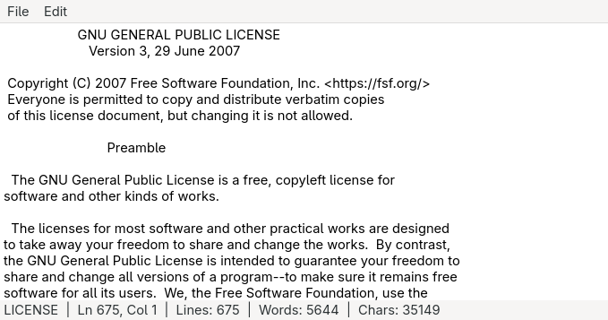

## Overview

Notepad is a lightweight text editor built with the GTK4 toolkit and written in
C. It provides the essentials for editing plain text files - open, save, find,
and replace - without unnecessary complexity. The interface follows standard
GTK4 conventions including a menu bar, a scrollable text area, and a
collapsible find/replace bar that slides in from the bottom.

A live status bar tracks the current filename, cursor position (line and
column), total line count, word count, and character count as you type.

## Screenshots

<p align="center">
  
</p>

## Features

- Open, save, and save-as via GTK file dialogs
- Find and replace with case-insensitive matching and wrap-around
- Animated slide-up find/replace bar (Escape to dismiss)
- Status bar showing filename, line/col, lines, words, and chars
- Modified-file indicator in the window title
- Keyboard shortcuts for all common actions
- Handles files passed on the command line via GApplication open signal

## Keyboard Shortcuts

| Action          | Shortcut            |
|-----------------|---------------------|
| New             | Ctrl+N              |
| Open            | Ctrl+O              |
| Save            | Ctrl+S              |
| Save As         | Ctrl+Shift+S        |
| Quit            | Ctrl+Q              |
| Find            | Ctrl+F              |
| Find & Replace  | Ctrl+H              |
| Next match      | Enter (in find bar) |
| Close find bar  | Escape              |

## Dependencies

```
gcc
libgtk-4-dev
make
```

## License

This work is licensed under the GNU General Public License version 3 (GPLv3).

[](https://www.gnu.org/licenses/gpl-3.0.en.html)
